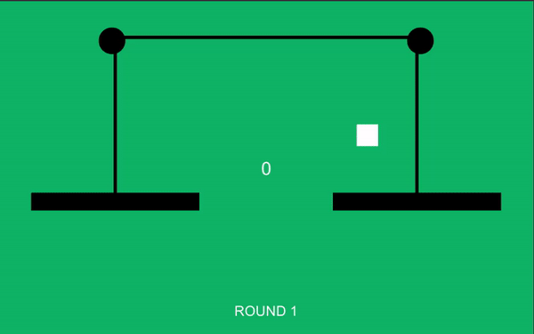

Here are a few of the projects I created in Unity and C#

# Monster Training RPG

A 2D turn-based RPG I developed in Unity. I used Scriptable Objects to store the data of the monsters and used the State Design Pattern to control FreeRoam, Battle, and Dialog states. 

The game is architected in a scalable way using clean coding practices.

# Mass Balance (Android Game)

A simple hyper-casual game that I developed in 2015. This was the first game I completed using Unity.

# AI to Play Football

Developed a complex AI that can play a simplified game of football using Finite State Machines. It uses multiple state machines, one to control individual agents and another to control the entire team.

I created this project after reading the book "Programming Game AI by Example" to test my learnings from it.

# Melee Combat System

Being a huge fan of games like Witcher and Assasins Creed, I wanted to build a simple combat system from scratch, and this is the result.